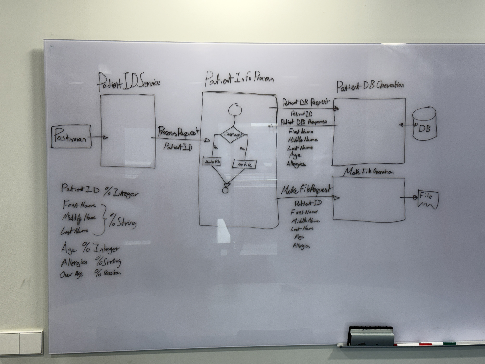
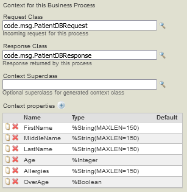
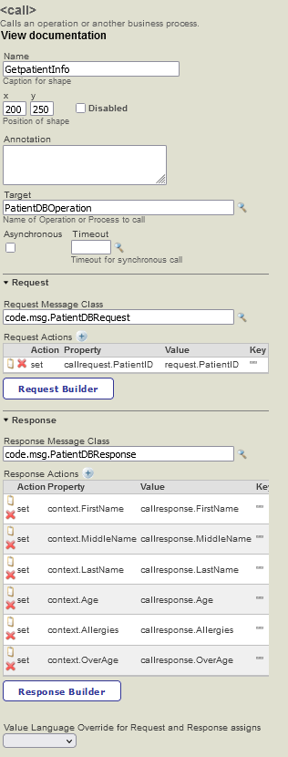
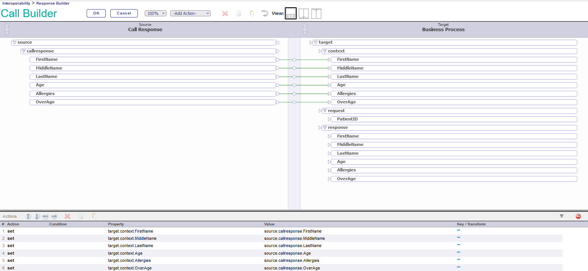
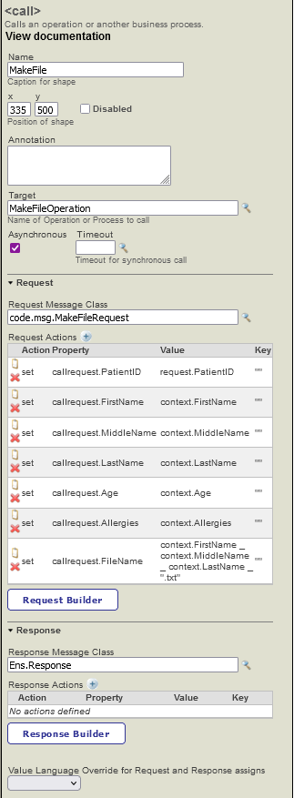
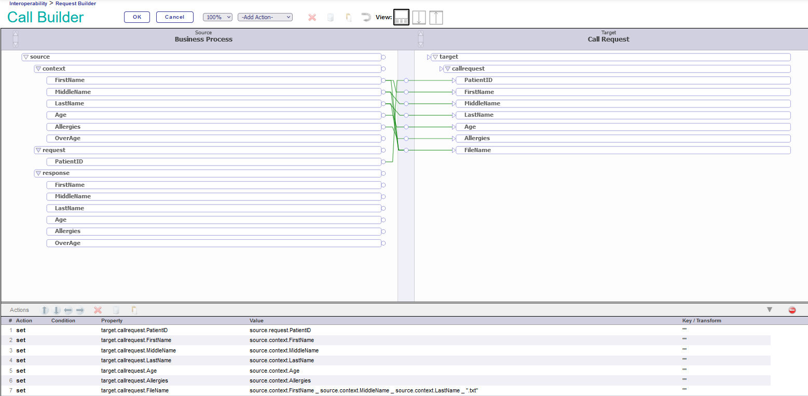
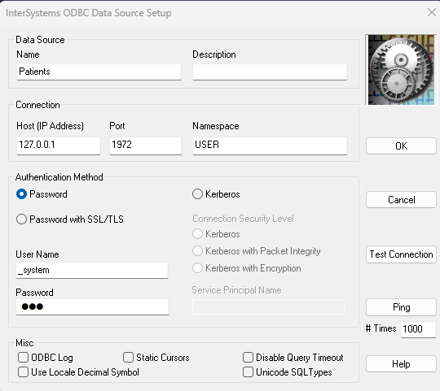

# Test 01
## Namespace
- ### Package:
	- This production will be in the pIRIS namespace and will be called: test01.
- ### Production:
	- This production will be in the test01 package and will be called: PatientInfo.
### 
## Variables
- PatientID %Integer
- FirstName %String
- MiddleName %String
- LastName %String
- Age %Integer
- Allergies %String
- OverAge %Boolean
## Messages
- ### ProcessRequest
    ```
    Class code.msg.ProcessRequest Extends Ens.Request
    {

    Property PatientID As %Integer;

    }
    ```
- ### PatientDBRequest
    ```
    Class code.msg.PatientDBRequest Extends Ens.Request
    {

    Property PatientID As %Integer;

    }
    ```
- ### PatientDBResponse
    ```
    Class code.msg.PatientDBResponse Extends Ens.Response
    {

    Property FirstName As %String;

    Property MiddleName As %String;

    Property LastName As %String;

    Property Age As %Integer;

    Property Allergies As %String;

    Property OverAge As %Boolean;

    }
    ```
- ### MakeFileRequest
    ```
    Class code.msg.MakeFileRequest Extends Ens.Request
    {

    Property PatientID As %Integer;

    Property FirstName As %String;

    Property MiddleName As %String;

    Property LastName As %String;

    Property Age As %Integer;

    Property Allergies As %String;

    Property FileName As %String;

    }
    ```
## Dispatch
- ### RestDisp
    ```
    Class code.RestDisp Extends %CSP.REST
    {

    XData UrlMap [ XMLNamespace = "http://www.intersystems.com/urlmap" ]
    {
    <Routes>
    
    <Route Url="/patientinfo/:PatientID/:RequestedOperation/:LikelyOutcome" Method="GET" Call="PatientInfoProcess" Cors="true"/>
    
    </Routes>
    }

    ClassMethod GetPatientInfo(PatientID As %Integer) As %Status
    {
        set tSC = $$$OK
        try {
            set tSC = ##class(Ens.Director).CreateBusinessService("OperationRestService",.tService)
            $$$ThrowOnError(tSC)

            set request = ##class(code.msg.ProcessRequest).%New()
            set request.PatientID = PatientID
            set tSC = tService.ProcessInput(request, .output)
            $$$ThrowOnError(tSC)
            do %response.SetHeader("ContentType", "application/json")
            #Dim output As %Library.DynamicObject
            set output = {"status":"pending"}

            write output.%ToJSON()
        }
        catch ex {
            set tSC = ex.AsStatus()
        }
        return tSC
    }

    }
    ```
## Buisness Services
- ### FilePatientIDService
	```
	Class code.bs.FilePatientIDService Extends Ens.BusinessService
    {

    Parameter ADAPTER = "EnsLib.File.InboundAdapter";

    Method OnProcessInput(pRequest As %Stream.Object, Output pResponse As %RegisteredObject) As %Status
    {
                set tLine = pRequest.ReadLine()
                $$$TRACE("tLine = "_tLine)
                set tRequest = ##class(code.msg.ProcessRequest).%New()
                $$$TRACE("Created request.")
                set tRequest.PatientID = $piece(tLine,":",1)
                $$$TRACE("PatientID = "_ tRequest.PatientID)
                set st = ..SendRequestAsync("PermissionToOperate",tRequest)
                ///
                Quit $$$OK
    }

    }
	```
- ### PatientIDService
    ```
    Class Code.Test01.bs.PatientIDService Extends %RegisteredObject
    {
    Method OnProcessInput(pInput As code.msg.ProcessRequest, Output pOutput As %RegisteredObject) As %Status
    {
        set tSC = $$$OK
        try {
            //set tRequest = ##class(interop.msg.PatientInfoRequest).%New()
            //set tRequest.PatientID = pInput.StringValue
            set tSC = ..SendRequestSync("SalaryAdjustmentProcess", pInput, .tResponse)
            $$$ThrowOnError(tSC)
        }
        catch ex {
            set tSC = ex.AsStatus()
        }
        return tSC
    }
    }
    ```
## Buisness Processes
- ### PatientInfoProcess
	- ### 
	- ### 
	- ### 
	- ### 
	- ### 
	- ### 
	- ### 
	- ### 
## Buisness Operations
- ### PatientDBOperation
    ```
    Class code.bo.PatientDBOperation Extends Ens.BusinessOperation
    {

    Parameter ADAPTER = "EnsLib.SQL.OutboundAdapter";

    Parameter INVOCATION = "Queue";

    Method PatientInfo(pRequest As code.msg.PatientDBRequest, Output pResponse As code.msg.PatientDBResponse)
    {
        set pResponse=##class(code.msg.PatientDBResponse).%New()
        
        set query = "Select FirstName, MiddleName, LastName, Age, Allergies from SQLUser.Patients where PatientID = "_pRequest.PatientID
        set st =..Adapter.ExecuteQuery(.tResult,query)
        $$$TRACE("st = "_st) 
        do tResult.Next()

        set pResponse.FirstName=tResult.Get("FirstName")    
        set pResponse.MiddleName=tResult.Get("MiddleName")
        set pResponse.LastName=tResult.Get("LastName")
        set pResponse.Age=tResult.Get("Age")
        set pResponse.Allergies=tResult.Get("Allergies")
        set pResponse.OverAge=0
        if (pResponse.Age >= 18) {
            set pResponse.OverAge=1
        }

        Quit $$$OK
    }

    XData MessageMap
    {
    <MapItems>
            <MapItem MessageType="code.msg.PatientDBRequest">
                <Method>PatientInfo</Method>
            </MapItem>
        </MapItems>
    }

    }

    ```
- ### MakeFileOperation
    ```
    Class code.bo.MakeFileOperation Extends Ens.BusinessOperation
    {

    Parameter ADAPTER = "EnsLib.File.OutboundAdapter";

    Parameter INVOCACION = "Queue";

    /*
    Method DecisionFile(pRequest As code.msg.MakeFileRequest, Output pResponse As Ens.Response)
    {
            set tData = $ZDATETIME($H)_$$$NL_
                        pRequest.InsuranceCompany_$$$NL_
                        pRequest.Contents.PatientID_$$$NL_
                        pRequest.Contents.RequestedOperation_$$$NL_
                        pRequest.Contents.LikelyOutcome_$$$NL
            set st = ..Adapter.PutString(pRequest.FileName, tData)
            $$$TRACE("st = "_$system.Status.DisplayError(st))

            Quit $$$OK
    }
    */
    Method NotifyFile(pRequest As code.msg.MakeFileRequest, Output pResponse As Ens.Response)
    {
            set tData = $ZDATETIME($H)_$$$NL_
                        pRequest.PatientID_" "_
                        pRequest.FirstName_" "_
                        pRequest.MiddleName_" "_
                        pRequest.LastName_" "_
                        pRequest.Age_" "_
                        pRequest.Allergies_" "
            set sc = ..Adapter.PutString(pRequest.FileName, tData)
            $$$TRACE("st = "_$system.Status.DisplayError(sc))

            Quit $$$OK
    }

    XData MessageMap
    {
    <MapItems>
                <!-- <MapItem MessageType="code.msg.MakeFileRequest">
                <Method>DecisionFile</Method>
            </MapItem> -->
                <MapItem MessageType="code.msg.MakeFileRequest">
                <Method>NotifyFile</Method>
            </MapItem>
        </MapItems>
    }

    }
    ```
## Data Base
- ### SQL Table: Patients
    ```
    CREATE TABLE Patients (
        PatientID INT PRIMARY KEY,
        FirstName VARCHAR(150),
        MiddleName VARCHAR(150),
        LastName VARCHAR(150),
        Age INT,
        Allergies VARCHAR(150)
    )
    ```
- ### SQL Insert Rows
    ```
    INSERT INTO Patients (PatientID, FirstName, MiddleName, LastName, Age, Allergies) 
    VALUES (1, 'Mrtin', 'L.' , 'Gore', 63, 'None');
    ```
- ### SQL Update Rows
```
UPDATE Patients 
SET FirstName = 'Martin' 
WHERE PatientID = 1;
```
- ### DSN
	- Open ODBC 64 bits
	- Under "System DSN" click "Add..."
	- 
	- Select the "InterSystems IRIS" then click "Finish"
	- 
	- Now fill the server info with the following details then click "Ok".
	- 
